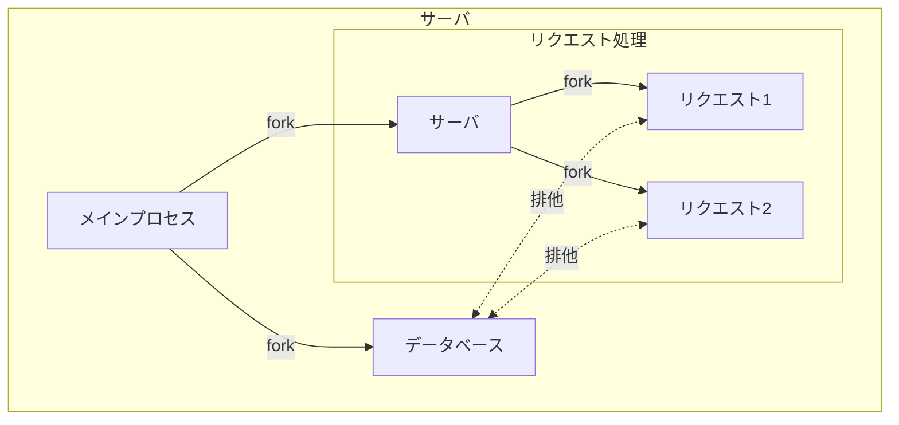

# ChatRoom Server

## プロセス

- リクエストごとに新しいプロセスを生成し，レスポンスを返すと終了．
- 1 つの HTTP リクエストに対して 1 つのレスポンスを返す．

## データの管理

- ルームリストとメッセージリストはデータベースに保存する．
- データベースは SQLite3 を使用する．

## フローチャート

```mermaid
flowchart TD

subgraph サーバ
  main[メインプロセス]
  db[データベース]
  server[サーバ]

  main --fork--> db & server

  subgraph リクエスト処理
    server --fork--> req1[リクエスト1]
    server --fork--> req2[リクエスト2]
  end

  db <-.排他.-> req1
  db <-.排他.-> req2
end
```
